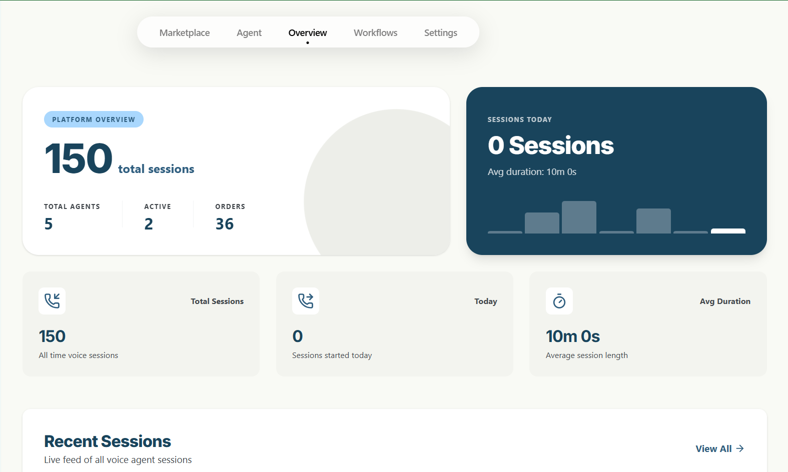
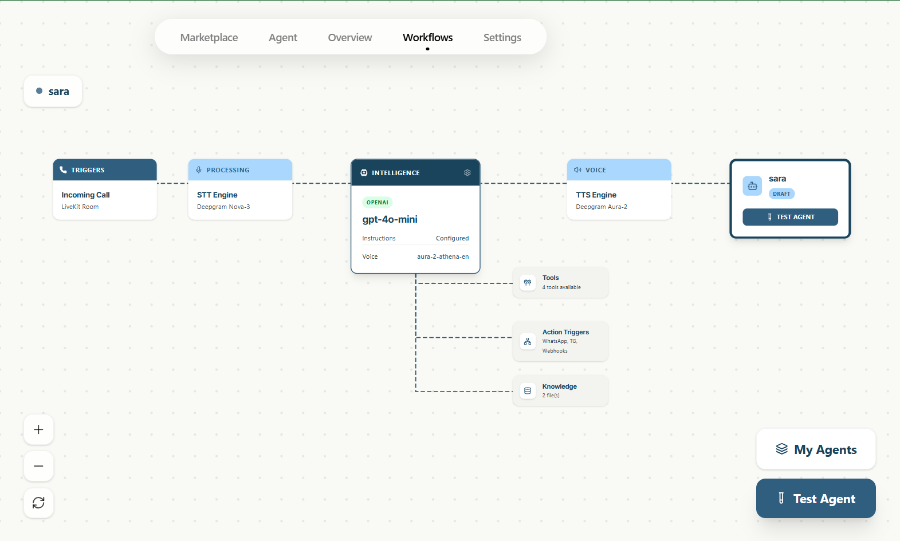
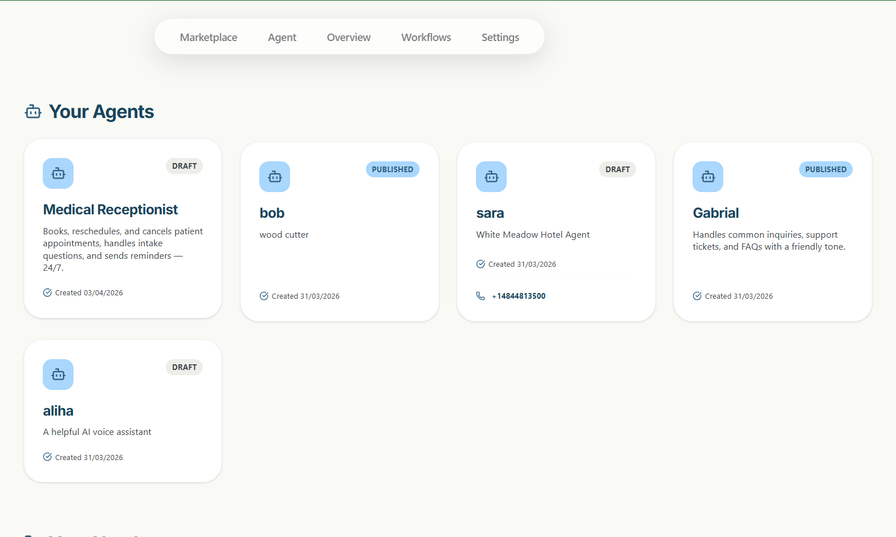
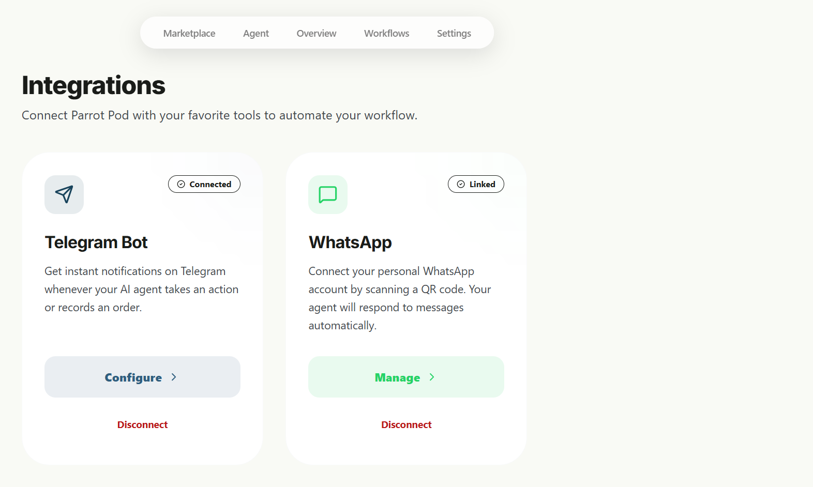
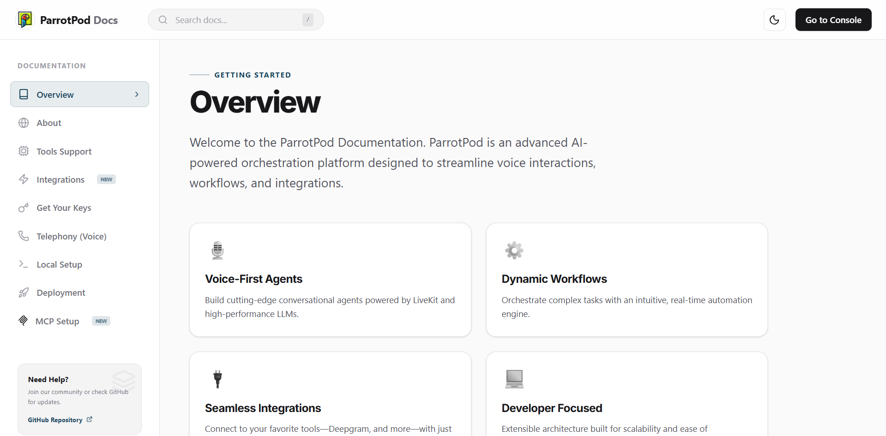

<div align="center">
  
  # Parrot Pod - No-Code AI Voice Agent Builder
  **A powerful, open-source no-code stack to build, configure, and customize AI Voice Agents.**

  

</div>

## 📖 Overview

Parrot Pod is a full-stack open-source no-code platform that enables you to swiftly build, configure, and manage high-performance **AI Voice Agents**. Built with modern technologies (FastAPI, React, LiveKit, Deepgram, OpenAI, and Gemini), Parrot Pod provides everything you need to create context-aware agents capable of seamless verbal interactions, file-based knowledge ingestion, and messaging integrations like WhatsApp and Telegram.

## ✨ Key Features

- 🎙️ **Real-time Voice Agents**: Powered by LiveKit, Deepgram (STT/TTS), and OpenAI / Gemini.
- 🧠 **Context-Aware Knowledge Base**: Agents can ingest PDF/TXT files to automatically extract and read context using local RAG patterns.
- 💬 **WhatsApp & Telegram Integration**: Built-in bridging functionality for agents to place orders, send notifications, and interface with apps seamlessly.
- 🖥️ **Sleek VITE Frontend Dashboard**: Easy-to-use GUI for creating agents, adjusting voices, uploading knowledge files, and tracking metrics.
- 🤖 **MCP Documentation Server integration**: Query Parrot Pod’s internal docs instantly using the bundled `parrotpod-mcp` server.

---

## 📸 Screenshots

<div align="center">

### 🖥️ Dashboard & Features
| | |
|---|---|
|  |  |
|  |  |

### 📚 Documentation Portal


</div>

---


## 🏗️ Technical Architecture

Parrot Pod consists of three primary components working together:

1. **`backend/`** (FastAPI / LiveKit Worker)
   - Handles REST API requests, SQLite database operations, and WhatsApp messaging via Baileys.
   - Runs the **Voice Agent Worker** (`voice_agent.py`) that fields LiveKit room connections, interfaces with Deepgram, and processes tool-calls via OpenAI.
   
2. **`frontend/`** (React / Vite)
   - Serves the administrative dashboard styled with Tailwind CSS.
   - Leverages `livekit-client` for in-browser microphone and speaker tests.

3. **`parrotpod-mcp/`** (MCP Documentation Server)
   - A standalone Model Context Protocol (MCP) server for instant integrations into your AI dev tools (like Cursor, Claude Desktop).

---

## 🚀 Quick Start

You can install and run the entire application (frontend, backend, and voice services) with a few simple `npm` commands directly from the root directory.

### 1. Prerequisites
- **Node.js**: v18+ (for frontend and concurrently setup).
- **Python**: v3.10+ (for backend and AI workers).
- **uv**: The ultra-fast Python package installer & resolver (`pip install uv`).

### 2. Configure Environment Secrets
Make sure to duplicate the `.env.example` file in the `backend/` directory to `.env` and fill it with your credentials:
```bash
cp backend/.env.example backend/.env
```
_Required credentials include LiveKit (URL, API Key, API Secret), Deepgram API Key, and OpenAI API Key._

### 3. Install & Setup
Run the setup command to automatically install all Node.js and Python dependencies across the workspace:
```bash
npm install
npm run setup:all
```

### 4. Run the Application
Start the frontend, backend, and voice agent worker concurrently. This will automatically open `http://localhost:3000` in your default browser.
```bash
npm run dev
```

> **Note on Windows users:** Alternatively, you can double-click or run the `start.bat` file to quickly spin up the environment!

### 5. Using the MCP Documentation Server
To integrate Parrot Pod's documentation directly into your AI coding agent (like Cursor or Claude Desktop), add the following to your MCP client configuration:
```json
{
  "mcpServers": {
    "parrotpod-mcp": {
      "command": "npx",
      "args": [
        "-y",
        "github:muhdaliyan/parrotpod-mcp"
      ]
    }
  }
}
```

---

## 🔌 API Endpoints
A full interactive API documentation is generated by FastAPI and can be accessed at `http://localhost:8000/docs` while the backend is running.

Here are a few core endpoints:
- `GET/POST /api/agents`: Manage voice agents
- `POST /api/agents/{id}/files`: Upload internal knowledge base files
- `POST /api/agents/{id}/token`: Generate LiveKit WebRTC tokens
- `POST /api/notify/telegram`: Trigger Telegram bot alerts

---

## 🤝 Contributing

We welcome contributions! Whether it is adding new LiveKit plugins (like GCP STT or local Silero), enhancing the dashboard, or cleaning up documentation. Feel free to open a Pull Request.

1. Fork the Project
2. Create your Feature Branch (`git checkout -b feature/AmazingFeature`)
3. Commit your Changes (`git commit -m 'Add some AmazingFeature'`)
4. Push to the Branch (`git push origin feature/AmazingFeature`)
5. Open a Pull Request

## 📄 License

Distributed under the MIT License. See `LICENSE` for more information.